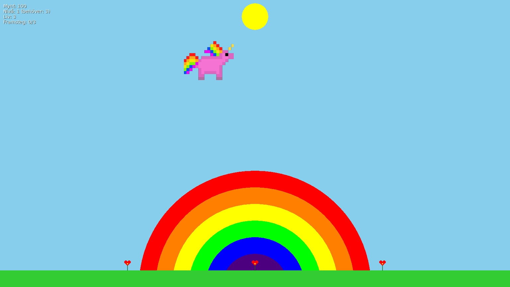
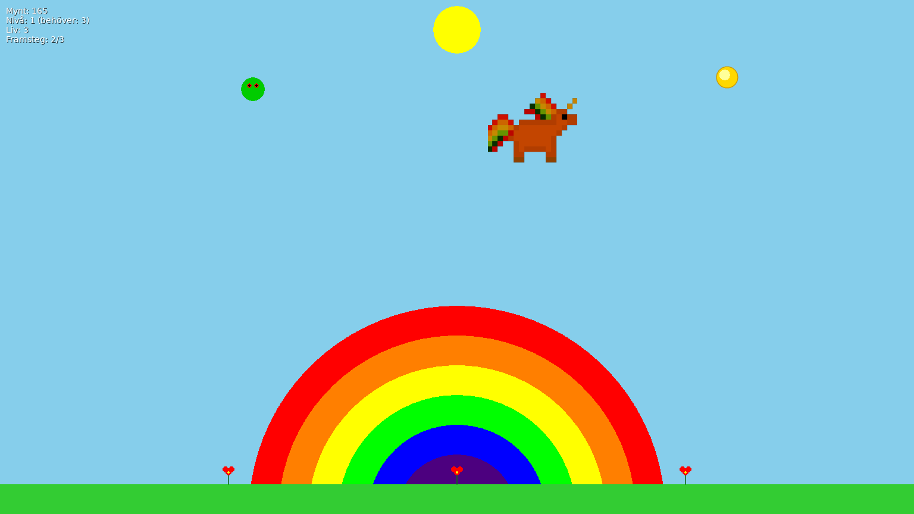
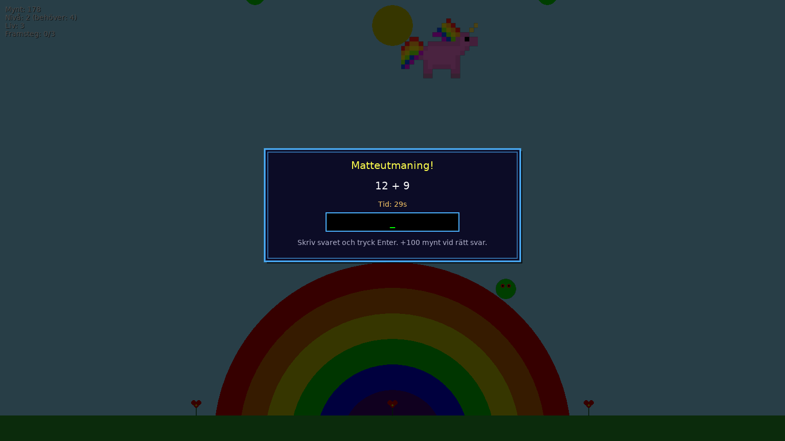
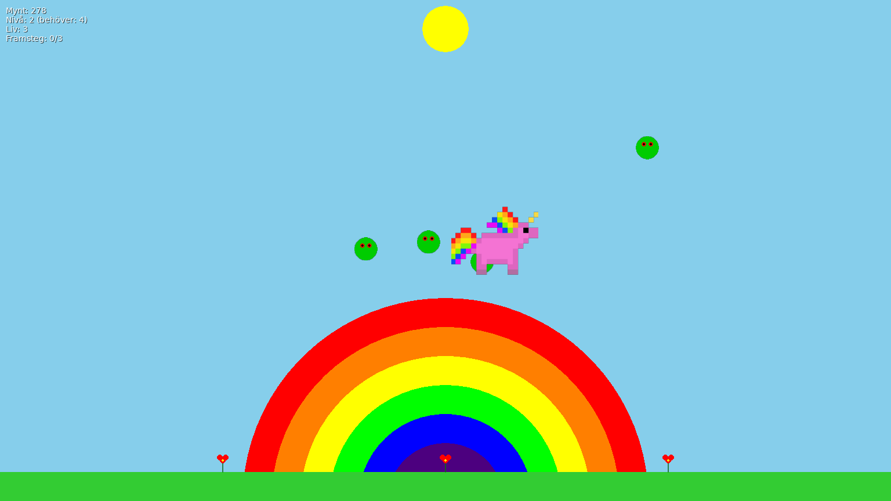

# Unicorn Flight with LÖVE

Unicorn Flight is a charming, educational LÖVE game that teaches basic arithmetic while delivering light, arcade-style action. Guide your unicorn skyward, collect coins, avoid trolls, and solve short math challenges to progress — perfect for unicorn lovers of ages 7–9. Features Swedish localization and retro-style dialog boxes.

## Screenshots

<p align="center">
  
  
</p>
<p align="center">
  
  
</p>

## Gameplay

- **Player Profiles**: Enter your name at the start or select from previous players. High scores are automatically tracked per player!
- Fly the unicorn upward using the UP arrow key and navigate with LEFT/RIGHT arrows.
- Reach the sun multiple times to advance stages and earn small coin rewards (+3 coins per touch).
- Avoid falling trolls that can cost lives.
- Start with 3 lives and 100 coins.
- Game ends when all lives are lost by hitting trolls or the ground.

**Collectible Coins**: Golden coins spawn periodically in the upper play area. Collect them to earn +10 coins each and progress toward stage advancement. Coins have a generous 78-pixel collection radius and remain visible for 30 seconds.

**Math Challenges**: Each stage advance triggers a retro-style math quiz dialog (20s time limit). Answer correctly to earn +100 coins! Wrong answers display the correct solution in a retro dialog box. Problems scale with difficulty and include both standard additions and "missing value" equations (e.g., `3 + X = 10`).

**Scoring System**:
- +3 points for each sun touch
- +10 points per collected coin
- +100 points for correct quiz answers
- Bonus points for stage completion (50 × stage number)
- Beat your high score to see a glowing gold celebration screen!

**Progressive Difficulty**: 
- Extra lives start at 250 coins and increase by +75 coins per stage
- Troll speed and spawn rates increase with each stage
- Sun hits and coin collection requirements grow progressively

## Performance Optimizations

The game uses advanced optimization techniques:
- **Memoization**: Cached sprites, formatted strings, and locale lookups
- **Object pooling**: Recycled trolls and coins to reduce garbage collection
- **Optimized collision detection**: Squared distance calculations (no sqrt)
- **Pre-calculated constants**: Rainbow colors, collision radii cached at module level
- **Inner functions**: Strategic use of inner functions for hot paths and repeated operations
- **Component-based architecture**: Separated concerns reduce coupling and improve maintainability

## High Score System

Player names and high scores are automatically saved to `scoreboard/highscores.txt` (excluded from version control). Features:
- **Player selection**: Choose from previous players or create a new profile
- **Per-player tracking**: Each player maintains their own high score
- **Automatic saving**: Scores are saved immediately upon game over
- **Celebration screen**: New high scores trigger a glowing gold retro dialog with encouraging messages in both Swedish and English
- **Ranking display**: See your rank among all players

## Prerequisites

- [LÖVE framework](https://love2d.org/) installed
- Lua and LuaRocks for unit testing:
  - Download and install LuaRocks from [luarocks.org](https://luarocks.org/)
  - Run `luarocks install busted` to install the Busted testing framework

This project is built for LÖVE 11.x and requires no external media assets except the unicorn sprite; everything else is drawn procedurally.

## Running the Game

Open a terminal in the project directory and run:

```
love .
```

On Windows, use the included `run_game.bat` to launch the game.

## Running Tests

After installing Busted, run:

```
busted spec/
```

## Project Structure

- `main.lua`: Main game entry point and LÖVE callbacks
- `game.lua`: Core game logic with progression, coins, math quizzes, and retro dialog rendering
- `unicorn.lua`: Unicorn class with optimized movement and sprite rendering
- `troll.lua`: Pre-rendered troll canvas with optimized collision detection
- `troll_manager.lua`: Manager for troll pooling and lifecycle
- `quiz_manager.lua`: Math problem generation and quiz state management
- `coin.lua`: Collectible coin with generous collision detection
- `field_coins.lua`: Field coin manager with pooling
- `locales/`: Localization files (Swedish and English)
- `conf.lua`: LÖVE configuration
- `spec/`: Unit tests directory

## Controls

- **Arrow keys**: Navigate (UP to fly, LEFT/RIGHT to move)
- **P**: Pause/unpause game
- **F11**: Toggle fullscreen
- **ESC**: Exit game (with confirmation)
- **R**: Restart after game over
- **Numeric keys + Enter**: Answer math challenges

## Educational Features

- **10,000 varied problems**: Age-targeted addition problems (7–9 years)
- **Time-limited quizzes**: 20 seconds per problem with countdown
- **Missing-operand equations**: Advanced challenges (e.g., `A + X = C`)
- **Retro dialog feedback**: Wrong answers show correct solution
- **Progressive difficulty**: Problems scale with player advancement

## Localization

The game supports multiple languages:
- **Swedish** (default): `locales/sv.lua`
- **English**: `locales/en.lua`

All UI text, quiz messages, and feedback are fully localized.

## Assets

- Unicorn sprite: `unicorn-sprite.png` (cached globally for performance)
- Troll graphics: Pre-rendered to canvas at module load
- Rainbow background: Drawn dynamically with cached colors
- All UI elements: Procedurally generated retro-style dialogs
